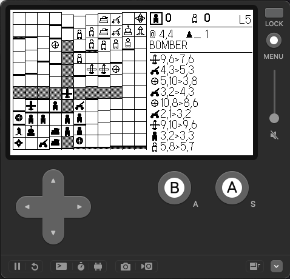

# War - Playdate

A chess-like, two-player strategy game for the Playdate. Capture the enemy
commander or wipe out all their attack pieces to win.

Ported in C from a Kotlin/LibGDX desktop original.



### Build & run

```shell
make clean && make && make run
```

### Tests

The game logic is split out from the Playdate rendering so it builds and runs
under stock clang. To exercise it:

```shell
make test
```

### Controls

| Button   | Action                                    |
|----------|-------------------------------------------|
| D-pad    | Move cursor across the 11×11 board       |
| A        | Select your piece / confirm destination  |
| B        | Cancel current selection / restart       |

### Pieces

| Piece        | Move                   | Attack                              |
|--------------|------------------------|-------------------------------------|
| Commander    | 1 in any direction     | 1 in any direction (game-over)      |
| Infantry     | 1 horiz/vert           | 1 diagonal (forced — no straight)   |
| Tank         | 1–2 horiz/vert         | 1–2 horiz/vert                      |
| Sniper       | 1–2 diagonal           | 1–2 diagonal                        |
| Artillery    | 1 in any direction     | 2–3 horiz/vert (then reloads 3 t.)  |
| Missile      | 1 in any direction     | 2–5 diagonal — self-destructs       |
| Air Defense  | 1 in any direction     | None (passively intercepts adj.)    |
| Bomber       | 1–4 horiz/vert         | 1–4 horiz/vert, can fly over allies |

* Tiles have elevation 0–4. Pieces cannot ascend/descend more than one level
  per step (except Artillery, Missile, Bomber which ignore terrain).
* Air Defense intercepts an adjacent enemy Bomber or Missile: both die.
* The board is symmetric so neither player gets a starting advantage.
